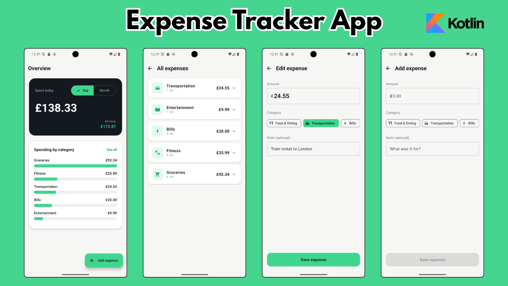

💷 Expense Tracker App
---
A modern Android expense tracker built with Kotlin and Jetpack Compose, backed by a local Room database. Log expenses, categorise them, and see your spending broken down and visualised — all offline, with a reactive UI that updates the moment your data changes.

This project builds on core Android CRUD patterns and goes further into data aggregation (computing totals and per-category breakdowns in SQL) and data visualisation (a hand-built spending chart).


## 📸 Screenshots



## ✨ Features


- **Dashboard overview** — see spending at a glance, with a toggle between today and this month, plus an all-time total.
- **Spending-by-category chart** — a hand-built horizontal bar chart showing where your money goes, drawn with plain Compose (no charting library).
- **Full CRUD** — add, edit, and delete expenses, with a confirmation step before deleting.
- **Categories** — assign each expense a category (Food, Transport, Bills, Groceries, and more), each with its own icon.
- **Expandable expense cards** — tap any expense to expand it, revealing the full note and edit/delete actions.
- **Reactive summaries** — totals and breakdowns recompute automatically whenever an expense is added, edited, or removed.
- **Offline first design** — all data lives locally in Room, so the app works with no network connection.
- **Cohesive design** — a custom ink-navy and mint visual identity, where green carries meaning (money, positive balances) rather than being decorative.


## 🛠️ Tech Stack

| Technology | Purpose |
| --- | --- |
| **Kotlin** | Primary language |
| **Jetpack Compose** | Declarative UI toolkit |
| **Material 3** | Design system and components |
| **Room** | Local SQLite persistence layer |
| **Hilt** | Dependency injection |
| **Navigation Compose** | In-app navigation between screens |
| **Kotlin Coroutines & Flow** | Asynchronous work and reactive data streams |
| **StateFlow** | Observable UI state |
| **KSP** | Annotation processing (Room & Hilt code generation) |

## 🧠 What this project demonstrates

Beyond standard CRUD, this app was built to practise a few specific concepts:


- Aggregate SQL queries in Room — SUM(amount) for totals and GROUP BY category for per-category breakdowns, including handling the NULL-over-empty-table edge case with COALESCE.
- Mapping queries to non-entity result classes — the category breakdown returns a custom CategoryTotal(category, total) data class rather than a full entity, with column aliasing so Room maps the results correctly.
- Combining multiple reactive streams — the ViewModel merges several Room Flows (the expense list plus daily, monthly, and per-category totals) into a single UI state with combine, so the whole dashboard stays in sync automatically.
- Data visualisation from scratch — the category bar chart is built with plain Compose primitives (Box widths scaled to each category's share of the largest), with a grow-in animation — no external charting dependency.


## 🏗️ Architecture

The app follows MVVM within a layered clean architecture:

UI (Compose) → ViewModel → Repository → DAO → Room Database


- UI layer — stateless Composable screens that observe state and emit events.
- ViewModel — exposes a single StateFlow<ExpenseUiState> built by combining the underlying data flows; handles add/edit/delete actions.
- Repository — an interface (domain layer) with an implementation (data layer), decoupling the ViewModel from Room.
- Data layer — Room entities, DAO (with aggregate queries), type converters, and the database definition.


Because Room exposes queries as Flow, data flows reactively: adding or editing an expense automatically re-emits through every dependent query, and the UI updates without any manual refresh.

## Project structure
```
com.example.expensetracker
├── App
│   ├── MainActivity
│   ├── ExpenseApplication     # @HiltAndroidApp entry point
├── data
│   ├── local
│   │   ├── dao            # ExpenseDao (CRUD + aggregate queries)
│   │   ├── entity         # ExpenseEntity
│   │   ├── CategoryTotal  # Non-entity result class for GROUP BY
│   │   ├── Converters     # Room TypeConverters
│   │   └── ExpenseDatabase
│   └── repository         # ExpenseRepositoryImpl
├── domain
│   ├── model              # ExpenseCategory and SpendingPeriod enums
│   └── repository         # ExpenseRepository (interface)
├── di                     # Hilt modules (DatabaseModule, RepositoryModule)
└── ui
    ├── feature
    │   ├── dashboard      # Overview + chart
    │   ├── expenses       # Expense list
    │   └── addEditExpense # Add / edit form
    ├── navigation         # NavGraph + Routes
    └── theme              # Shared colors & theme
```

## 💾 Database

- Expenses are stored in a single Room table; the app starts empty and fills with the user's own entries.
- A TypeConverter persists the ExpenseCategory enum (SQLite can't store it directly).
- Dates are stored as Long (epoch millis) — natively supported, no converter needed.
- The database is provided as a singleton via Hilt.
- Aggregate queries compute totals and per-category breakdowns directly in SQL rather than in Kotlin.

## 🚀 Getting Started

### Prerequisites

- Android Studio (latest stable recommended)
- JDK 17
- An Android emulator or physical device running **API 24+**

### Setup

1. Clone the repository:
   ```bash
   git clone https://github.com/badroben/ExpenseTrackerApp.git
   ```
2. Open the project in Android Studio.
3. Let Gradle sync and download dependencies.
4. Run the app on an emulator or device.


## 📦 Build Configuration

Dependencies are managed via a **version catalog** (`gradle/libs.versions.toml`) for centralized version control. Key tooling:

- Android Gradle Plugin 8.7.3
- Kotlin 2.2.10
- KSP for annotation processing (replacing the older kapt)
- Java 17 compatibility

## 🗺️ Possible Future Improvements


- Monthly budgets per category, with progress indicators
- Income entries and a net-balance view
- Date-range filtering (week / custom range)
- CSV export for backup
- Dark mode
- Proper Room migrations (instead of destructive fallback) for production data safety


## 📄 License

This project was built as a learning exercise. Feel free to use it as a reference.

---
Built with Kotlin, Jetpack Compose, Room, and Hilt.
